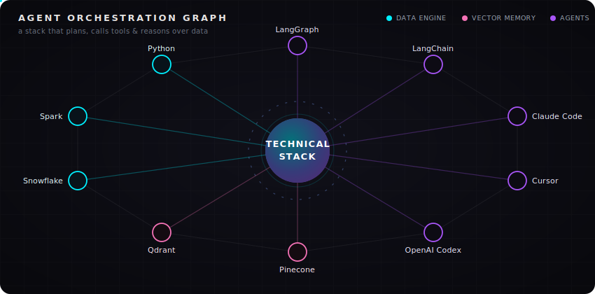
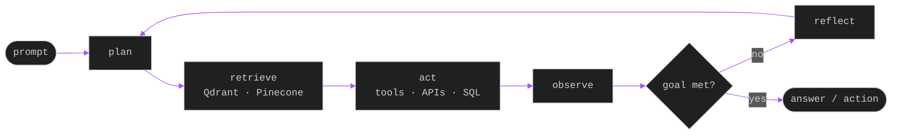
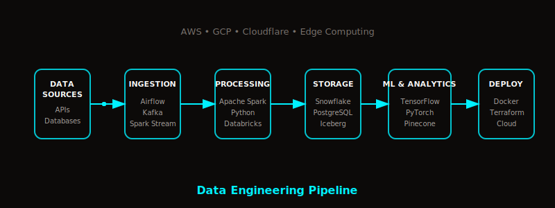

<!-- ============================ HERO ============================ -->
<div align="center">



<br/>

[](https://mouadja02.github.io)
[](https://www.linkedin.com/in/j-mouad)
[](mailto:mouadpro02@gmail.com)
[](https://github.com/mouadja02)

</div>

---

<!-- ============================ AGENT MANIFEST ============================ -->

### `~/ whoami` &nbsp;·&nbsp; the manifest, as an agent would read it

```yaml
# mouad.agent.yaml — system manifest
identity:
  name:    Mouad Jaouhari          # alias: MJ
  role:    Data & AI Engineer
  company: ATOS
  motto:   "From signals to systems — now with a mind of their own."

mission: >
  Turn raw, messy data into autonomous systems that
  retrieve, reason, and act — not just dashboards that report.

operating_loop: [ plan, retrieve, act, observe, reflect ]

stack:
  data:    [ Snowflake, Spark, Airflow, Kafka, dbt, Iceberg ]
  agentic: [ LangGraph, LangChain, RAG, CAG ]
  memory:  [ Qdrant, Pinecone ]
  tooling: [ Claude Code, OpenAI Codex, Cursor ]
  cloud:   [ AWS, GCP, Cloudflare ]

currently_building: [ dacli, dag-doctor, CAG-Lab ]
status: "open to agentic-AI & data-platform collaborations"
```

---

<!-- ============================ AGENT ORCHESTRATION GRAPH ============================ -->
<div align="center">



</div>

---

<!-- ============================ HOW I BUILD AGENTS ============================ -->

### How I think about agents — the reasoning loop

I don't build chatbots; I build systems that **plan, pull their own context, take actions, and self-correct**. Every agent I ship runs some version of this loop:


```mermaid
%%{init: {'theme':'dark','themeVariables':{'primaryColor':'#0d1117','primaryTextColor':'#e7e5e4','primaryBorderColor':'#00f0ff','lineColor':'#a855f7','fontFamily':'monospace','fontSize':'15px'}}}%%
flowchart LR
    U([ prompt ]) --> P[plan]
    P --> R["retrieve<br/>Qdrant · Pinecone"]
    R --> A["act<br/>tools · APIs · SQL"]
    A --> O[observe]
    O --> D{goal met?}
    D -->|no| Rf[reflect] --> P
    D -->|yes| Out([ answer / action ])
```

---

<!-- ============================ DATA -> INTELLIGENCE PIPELINE ============================ -->
<div align="center">



</div>

---

<!-- ============================ TECHNICAL ARSENAL ============================ -->
<div align="center">

## Technical Arsenal

**Agentic AI · LLM Engineering**


**Data Engineering**


**Languages · ML**


**Cloud · DevOps**


</div>

---

<!-- ============================ CAPABILITY MATRIX ============================ -->
<div align="center">



</div>

---

<!-- ============================ FEATURED BUILDS ============================ -->
<div align="center">

## Featured Builds — where Data meets Agents

<table align="center">
<tr>
<td width="50%" valign="top" align="left">

#### [dacli](https://github.com/mouadja02/dacli)
An intelligent CLI agent that builds production-grade data warehouses from scratch on your chosen data platform.

  
</td>
<td width="50%" valign="top" align="left">

#### [dag-doctor](https://github.com/mouadja02/dag-doctor)
An AI assistant that explains failed Airflow DAGs, pinpoints the root cause, and suggests safe fixes.

  
</td>
</tr>
<tr>
<td width="50%" valign="top" align="left">

#### [CAG-Lab](https://github.com/mouadja02/CAG-Lab)
Benchmarking Cache-Augmented Generation (CAG) against RAG for real-world knowledge systems.

  
</td>
<td width="50%" valign="top" align="left">

#### [skills](https://github.com/mouadja02/skills)
A curated collection of 149 agent skills for Claude Code & Cursor — engineering craft, AI agents, prompt engineering, and more.

  
</td>
</tr>
<tr>
<td width="50%" valign="top" align="left">

#### [bitcoin-technical-indicators-dataset](https://github.com/mouadja02/bitcoin-technical-indicators-dataset)
Bitcoin hourly OHLCV with 70+ technical indicators — a daily-updated dataset for ML & trading analysis.

  
</td>
<td width="50%" valign="top" align="left">

#### [end2end-datawarehouse-project](https://github.com/mouadja02/end2end-datawarehouse-project)
End-to-end data platform with real-time streaming and cloud processing — Kafka, Spark, AWS Glue, Snowflake, Iceberg.

  
</td>
</tr>
</table>

<sub>also brewing &nbsp;·&nbsp; <code>murmur</code> (local-LLM prompt overlay) &nbsp;·&nbsp; <code>mnemex</code> (LLM memory vault) &nbsp;·&nbsp; <code>neural-network-cuda</code> (NN from scratch → CUDA)</sub>

</div>

---

<!-- ============================ STATS ============================ -->
<div align="center">

## By the Numbers


<br/>


<br/>


</div>

---

<div align="center">

### Let's build systems that think.

<i>From raw signals → reasoning systems.</i>

[](https://mouadja02.github.io)
[](https://www.linkedin.com/in/j-mouad)
[](mailto:mouadpro02@gmail.com)

</div>
