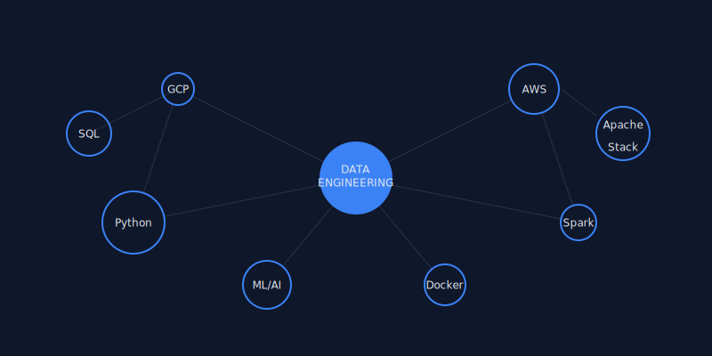

# Hi there! 👋 I'm a Data & ML Engineer

  
  
  
   
  
  **Building scalable data pipelines and ML solutions** 🚀
  
   
  

## 🔧 Tech Stack & Expertise

  
  
  

### Cloud Platforms

### Data Engineering

### Machine Learning & Development

## 🏗️ What I Build

## 🚀 Current Focus

- 🔭 Working on **large-scale data migration projects**
- 🌱 Learning **advanced MLOps practices**
- 👯 Looking to collaborate on **open-source data tools**
- 💬 Ask me about **data architecture & cloud solutions**

## 📈 Activity Graph

  
  
  

---

  
  **Let's connect and build something amazing together!** 🚀
  
  
  
  
  
  
  

 
